# Technical Architecture Documentation

## System Architecture Overview

### High-Level Architecture

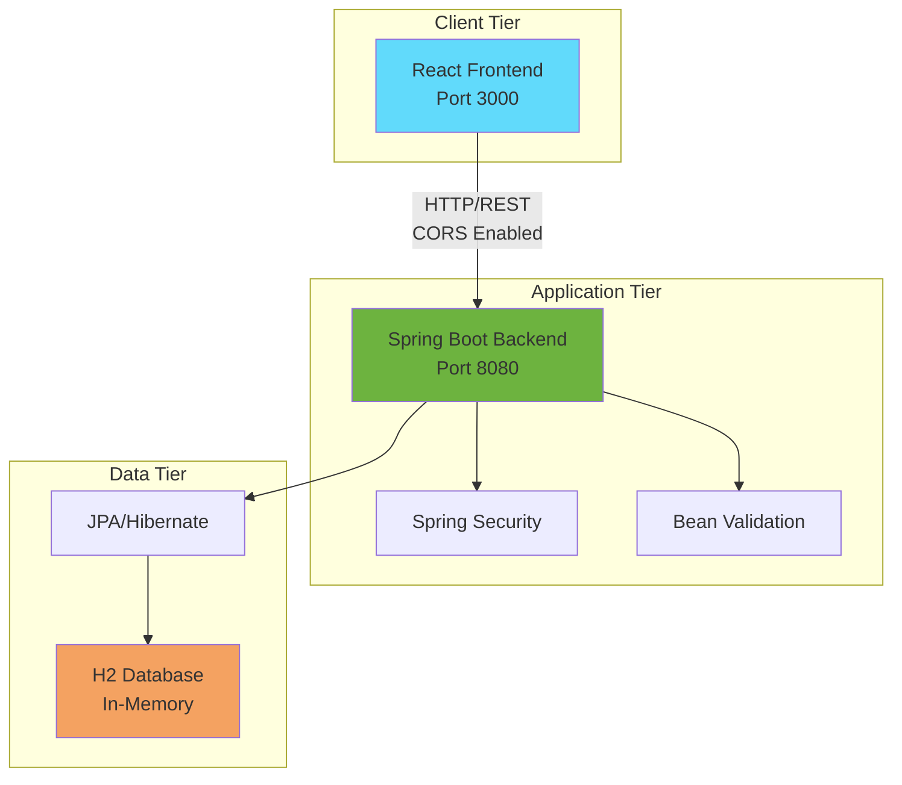

### Component Interaction Flow

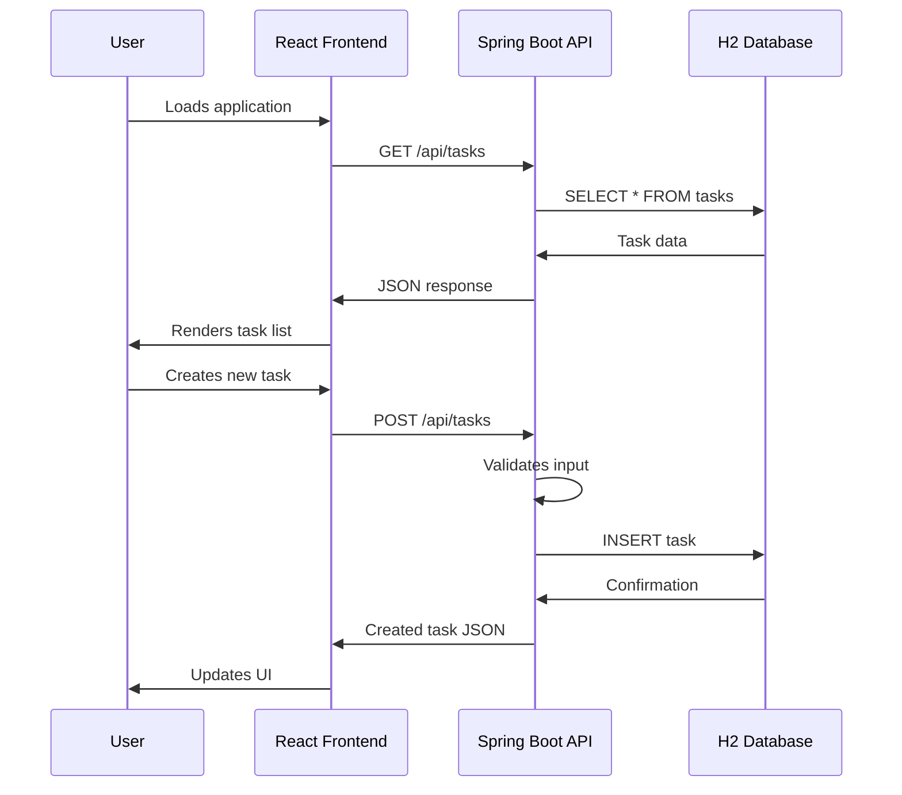

## Backend Architecture

### Layered Architecture Pattern

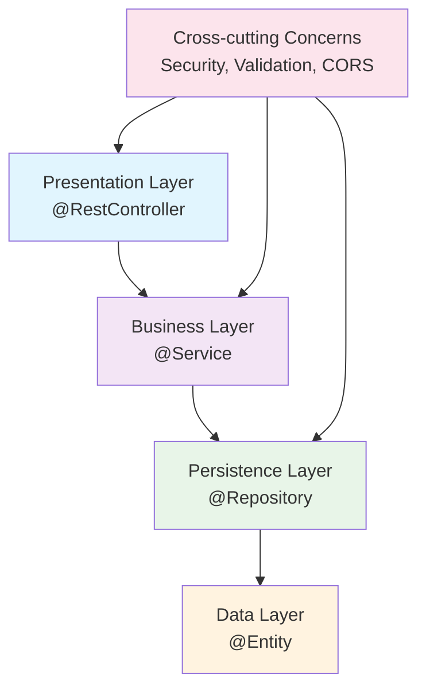

### Spring Boot Component Diagram

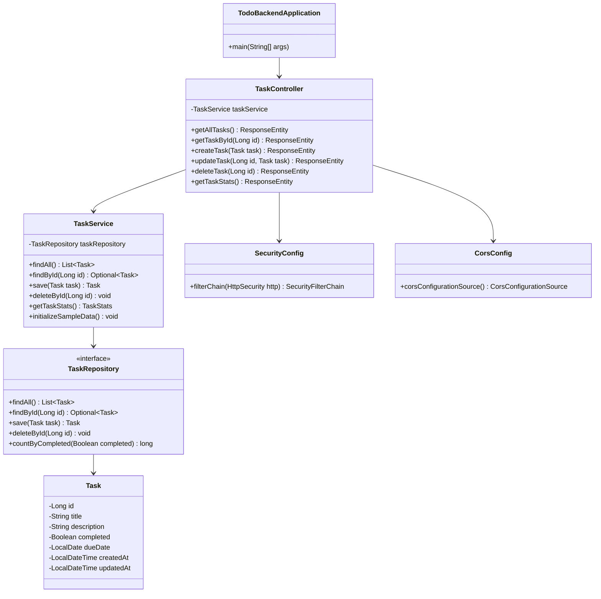

## Frontend Architecture

### React Component Hierarchy

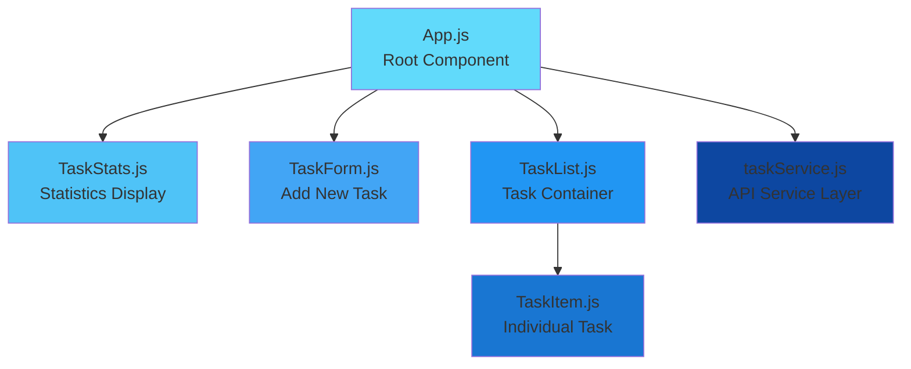

### State Management Flow

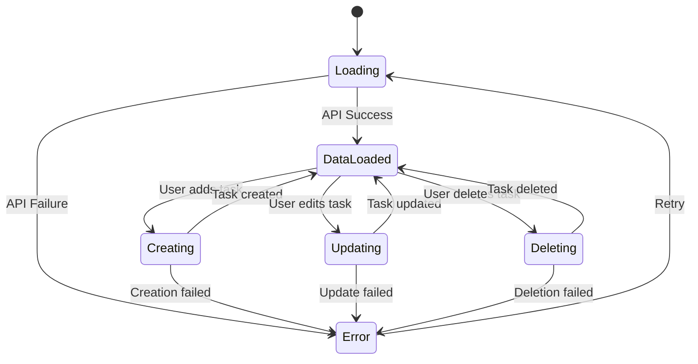

## Data Flow Architecture

### Request/Response Flow

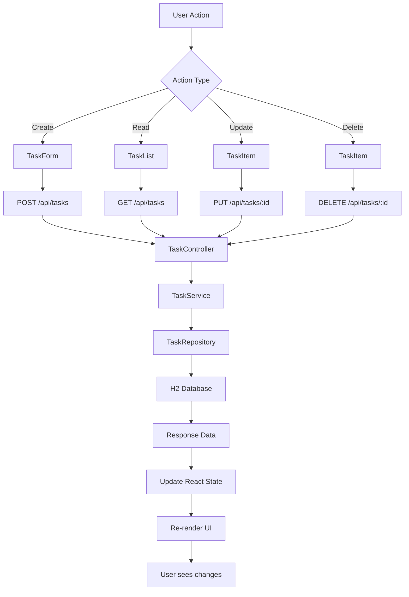

### API Data Transformation

```mermaid
graph LR
    A[Frontend Task Object] -->|JSON Serialization| B[HTTP Request Body]
    B -->|Network| C[Backend Controller]
    C -->|Validation| D[Task Entity]
    D -->|JPA| E[Database Row]
    
    E -->|JPA Mapping| F[Task Entity]
    F -->|JSON Serialization| G[HTTP Response]
    G -->|Network| H[Frontend Response]
    H -->|State Update| I[React Component State]
```

## Security Architecture

### Security Implementation Layers

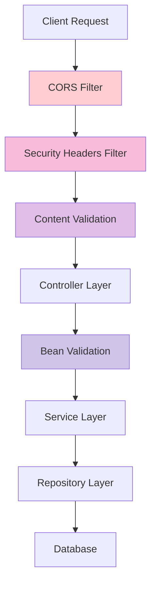

### CORS Configuration Flow

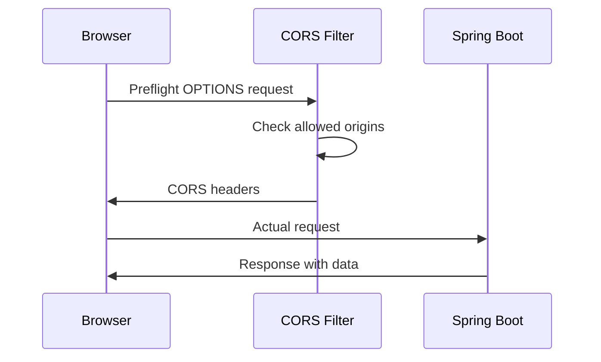

## Database Architecture

### Entity Relationship Model

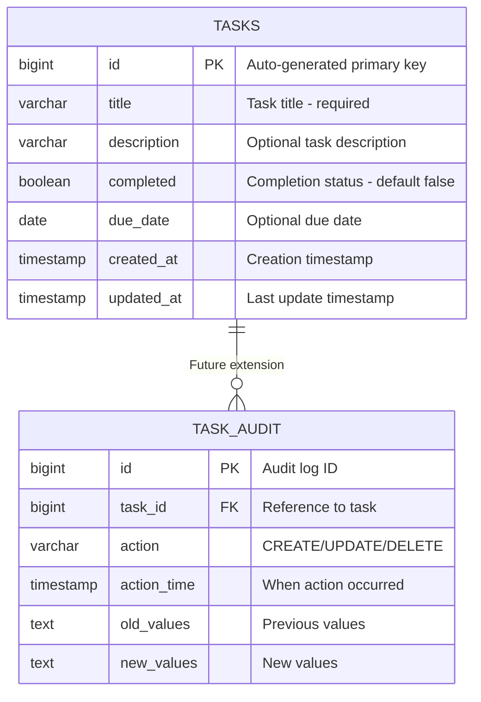

### Database Schema Evolution

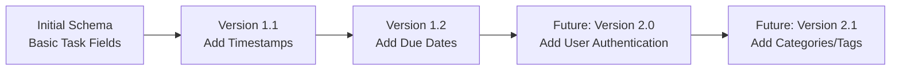

## Performance Architecture

### Caching Strategy

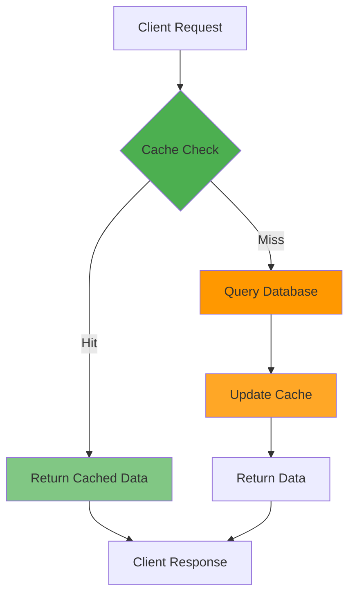

### Scaling Considerations

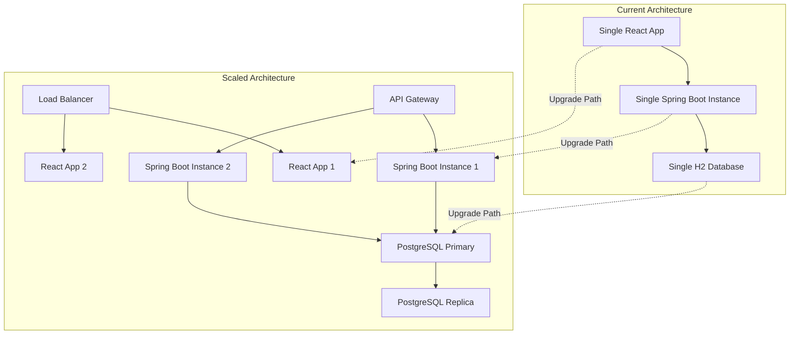

## Deployment Architecture

### Development Environment

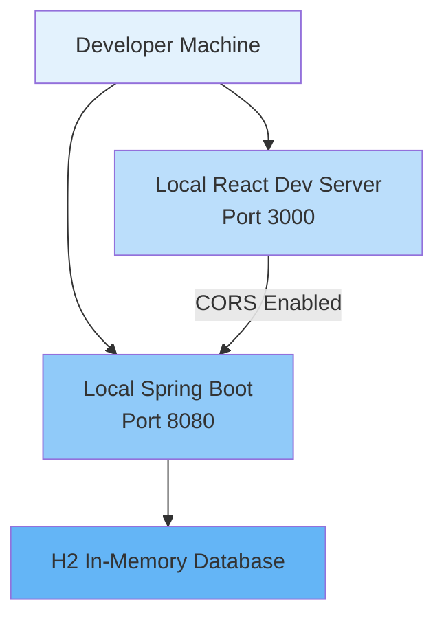

### Production Environment

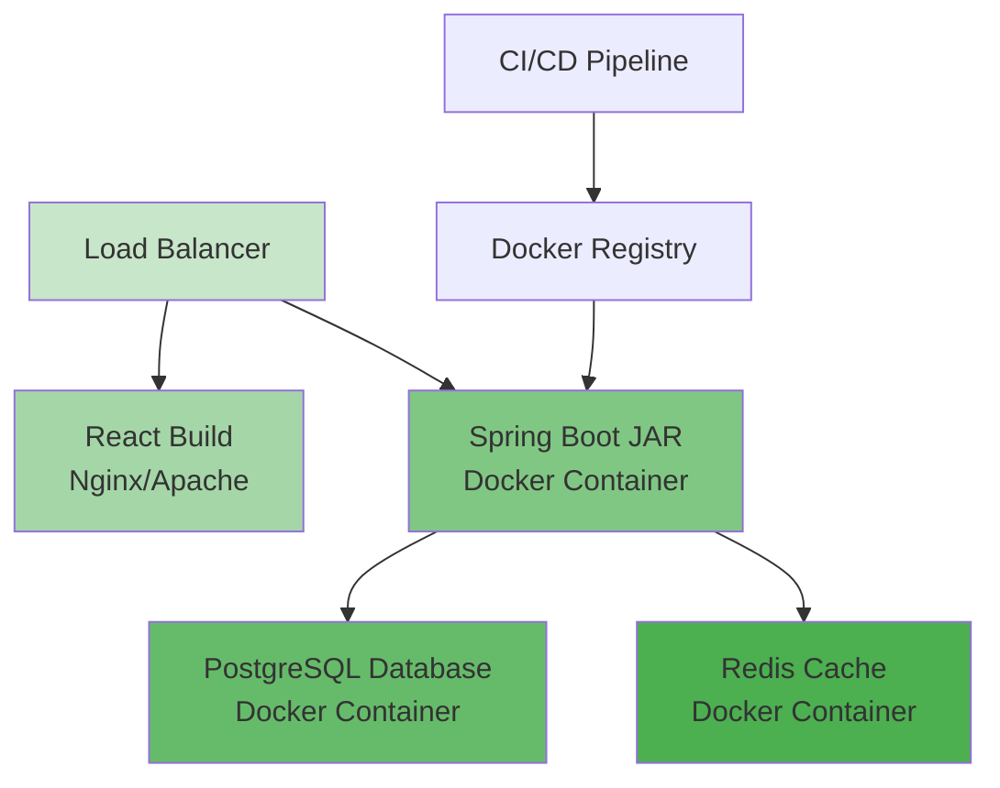

## Error Handling Architecture

### Exception Flow

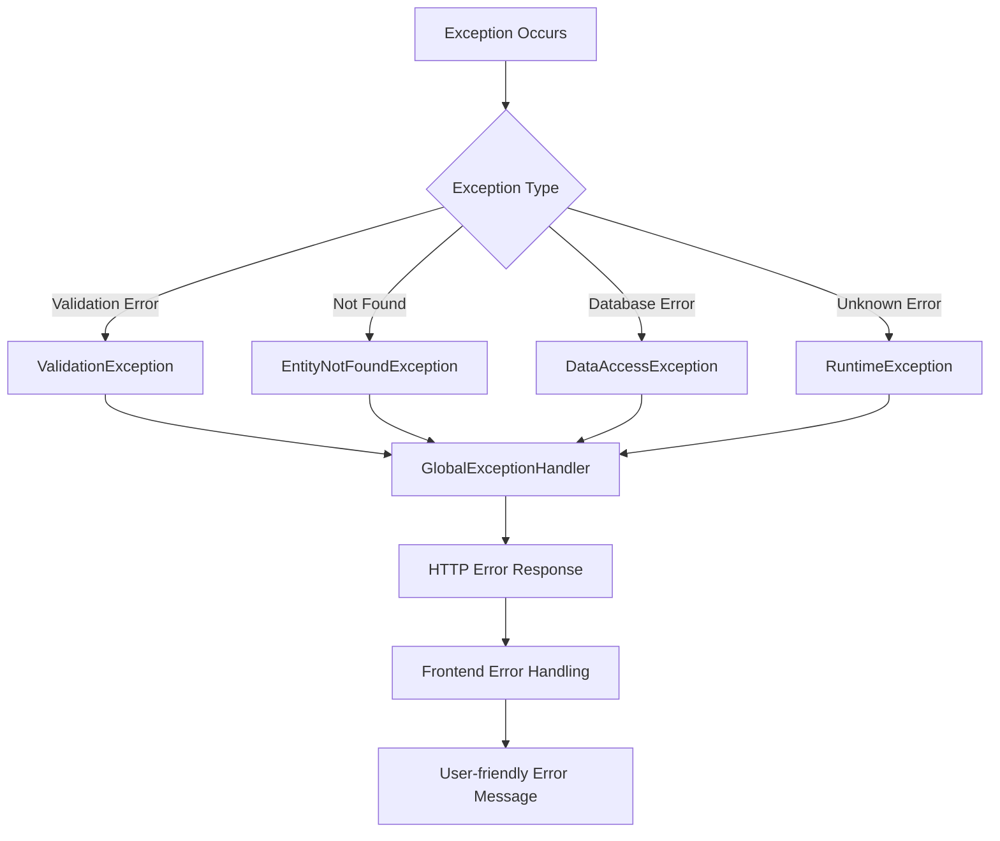

### Error Response Structure

```json
{
  "timestamp": "2025-07-16T17:00:00.000+00:00",
  "status": 400,
  "error": "Bad Request",
  "message": "Validation failed",
  "path": "/api/tasks",
  "details": [
    {
      "field": "title",
      "message": "Title is required"
    }
  ]
}
```

## Future Architecture Enhancements

### Microservices Evolution

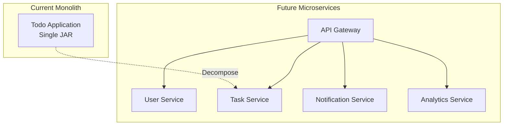

This architecture documentation provides a comprehensive view of the system design, component interactions, and future scalability considerations for the Todo application.
