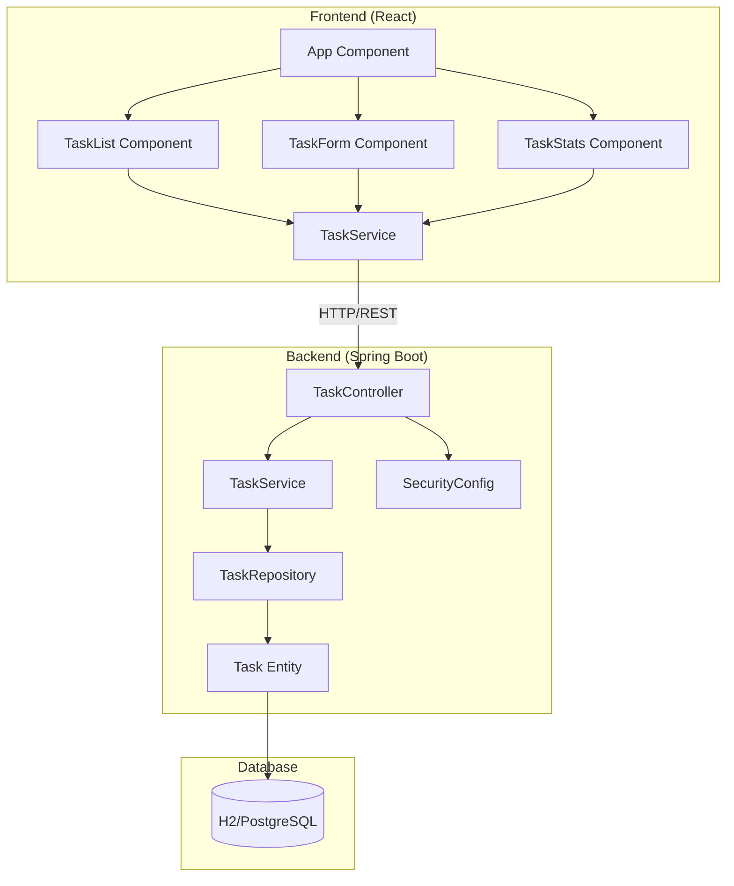
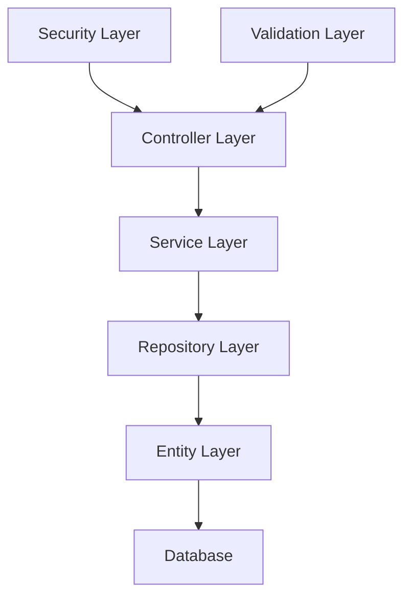
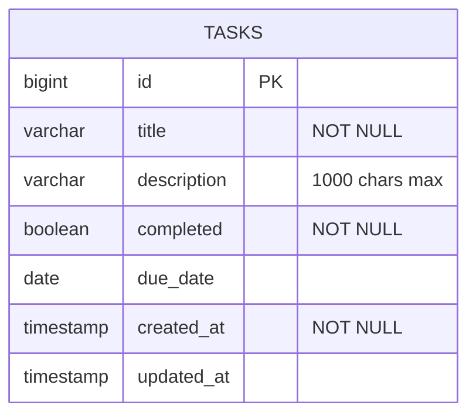
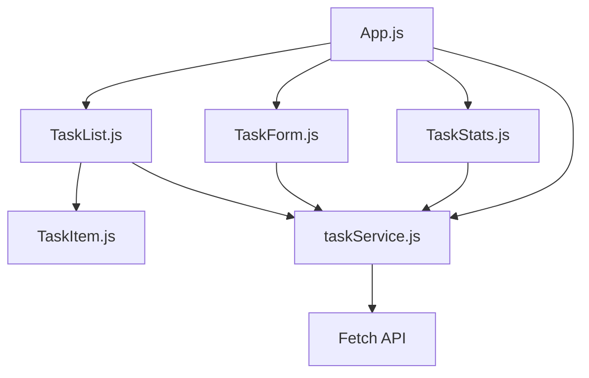
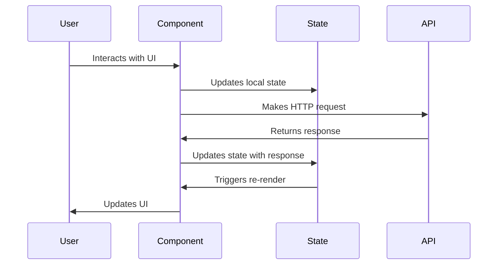

# Full-Stack Todo Application Documentation

A modern, secure, and responsive todo application built with Spring Boot backend and React frontend.

## Table of Contents

- [Full-Stack Todo Application Documentation](#full-stack-todo-application-documentation)
  - [Table of Contents](#table-of-contents)
  - [1. Project Overview](#1-project-overview)
    - [1.1 Features](#11-features)
    - [1.2 Technology Stack](#12-technology-stack)
      - [Backend](#backend)
      - [Frontend](#frontend)
    - [1.3 System Architecture](#13-system-architecture)
  - [2. Getting Started](#2-getting-started)
    - [2.1 Prerequisites](#21-prerequisites)
    - [2.2 Installation](#22-installation)
    - [2.3 Running the Application](#23-running-the-application)
  - [3. Backend Documentation](#3-backend-documentation)
    - [3.1 Architecture Overview](#31-architecture-overview)
      - [Layer Responsibilities:](#layer-responsibilities)
    - [3.2 API Endpoints](#32-api-endpoints)
      - [Task Management Endpoints](#task-management-endpoints)
      - [API Request/Response Examples](#api-requestresponse-examples)
    - [3.3 Database Schema](#33-database-schema)
      - [Table: `tasks`](#table-tasks)
    - [3.4 Security Configuration](#34-security-configuration)
      - [Security Headers](#security-headers)
      - [CORS Policy](#cors-policy)
    - [3.5 Data Models](#35-data-models)
      - [Task Entity](#task-entity)
  - [4. Frontend Documentation](#4-frontend-documentation)
    - [4.1 Component Architecture](#41-component-architecture)
    - [4.2 State Management](#42-state-management)
      - [App Component State](#app-component-state)
      - [State Flow](#state-flow)
    - [4.3 UI Components](#43-ui-components)
      - [Component Hierarchy](#component-hierarchy)
      - [Styling Approach](#styling-approach)
    - [4.4 API Integration](#44-api-integration)
      - [Service Layer](#service-layer)
  - [5. Security Implementation](#5-security-implementation)
    - [5.1 Security Headers](#51-security-headers)
    - [5.2 CORS Configuration](#52-cors-configuration)
    - [5.3 Input Validation](#53-input-validation)
    - [5.4 Security Best Practices](#54-security-best-practices)
  - [6. Development Guide](#6-development-guide)
    - [6.1 Project Structure](#61-project-structure)
    - [6.2 Building and Testing](#62-building-and-testing)
      - [Backend Build Commands](#backend-build-commands)
      - [Frontend Build Commands](#frontend-build-commands)
    - [6.3 Environment Configuration](#63-environment-configuration)
      - [Backend Configuration](#backend-configuration)
  - [7. Deployment](#7-deployment)
    - [7.1 Production Configuration](#71-production-configuration)
      - [Environment Variables](#environment-variables)
      - [Docker Configuration](#docker-configuration)
    - [7.2 Database Setup](#72-database-setup)
      - [PostgreSQL Configuration](#postgresql-configuration)
    - [7.3 Security Considerations](#73-security-considerations)
  - [8. Troubleshooting](#8-troubleshooting)
    - [8.1 Common Issues](#81-common-issues)
      - [Port Already in Use](#port-already-in-use)
      - [CORS Errors](#cors-errors)
      - [Database Connection Issues](#database-connection-issues)
    - [8.2 Debug Information](#82-debug-information)
      - [Enable Debug Logging](#enable-debug-logging)
      - [Frontend Debugging](#frontend-debugging)
  - [9. Contributing](#9-contributing)
    - [9.1 Development Workflow](#91-development-workflow)
    - [9.2 Code Standards](#92-code-standards)
      - [Backend (Java)](#backend-java)
      - [Frontend (JavaScript)](#frontend-javascript)
  - [License](#license)
  - [Support](#support)

---

## 1. Project Overview

### 1.1 Features

- ✅ **Task Management**: Create, read, update, and delete todo tasks
- ✅ **Task Completion**: Mark tasks as completed or pending
- ✅ **Due Dates**: Set and track task due dates
- ✅ **Statistics Dashboard**: View task completion statistics
- ✅ **Responsive Design**: Modern UI that works on all devices
- ✅ **Real-time Updates**: Immediate UI updates when tasks change
- ✅ **Security Hardened**: Comprehensive security headers and validation
- ✅ **REST API**: Clean RESTful API design

### 1.2 Technology Stack

#### Backend
- **Framework**: Spring Boot 3.2.1
- **Language**: Java 17
- **Database**: H2 (development), PostgreSQL (production)
- **ORM**: Hibernate/JPA
- **Security**: Spring Security
- **Build Tool**: Maven
- **Validation**: Bean Validation (JSR-303)

#### Frontend
- **Framework**: React 18.2.0
- **Language**: JavaScript (ES6+)
- **Styling**: Tailwind CSS 3.4.0
- **HTTP Client**: Fetch API
- **Build Tool**: Create React App
- **Package Manager**: npm

### 1.3 System Architecture



## 2. Getting Started

### 2.1 Prerequisites

- **Java 17** or higher
- **Node.js 16** or higher
- **npm** or **yarn**
- **Maven 3.6** or higher
- **Git** for version control

### 2.2 Installation

1. **Clone the repository**:
   ```bash
   git clone <repository-url>
   cd todo-application
   ```

2. **Backend Setup**:
   ```bash
   cd todo-backend
   mvn clean install
   ```

3. **Frontend Setup**:
   ```bash
   cd ../todo-frontend
   npm install
   ```

### 2.3 Running the Application

1. **Start the Backend** (Terminal 1):
   ```bash
   cd todo-backend
   mvn spring-boot:run
   # OR
   java -jar target/todo-backend-0.0.1-SNAPSHOT.jar
   ```

2. **Start the Frontend** (Terminal 2):
   ```bash
   cd todo-frontend
   npm start
   ```

## 3. Backend Documentation

### 3.1 Architecture Overview

The backend follows a layered architecture pattern:



#### Layer Responsibilities:
- **Controller Layer**: HTTP request handling and response formatting
- **Service Layer**: Business logic and transaction management
- **Repository Layer**: Data access and persistence
- **Entity Layer**: Data model definitions
- **Security Layer**: Authentication and authorization
- **Validation Layer**: Input validation and sanitization

### 3.2 API Endpoints

#### Task Management Endpoints

| Method | Endpoint | Description | Request Body | Response |
|--------|----------|-------------|--------------|----------|
| GET | `/api/tasks` | Retrieve all tasks | None | Array of Task objects |
| GET | `/api/tasks/{id}` | Retrieve specific task | None | Task object |
| POST | `/api/tasks` | Create new task | Task object | Created Task object |
| PUT | `/api/tasks/{id}` | Update existing task | Task object | Updated Task object |
| DELETE | `/api/tasks/{id}` | Delete task | None | Success message |
| GET | `/api/tasks/stats` | Get task statistics | None | Statistics object |

#### API Request/Response Examples

**Create Task (POST /api/tasks)**:
```json
{
  "title": "Complete project documentation",
  "description": "Write comprehensive documentation for the todo application",
  "dueDate": "2025-07-20",
  "completed": false
}
```

**Task Statistics (GET /api/tasks/stats)**:
```json
{
  "totalTasks": 8,
  "completedTasks": 2,
  "pendingTasks": 6
}
```

### 3.3 Database Schema



#### Table: `tasks`

| Column | Type | Constraints | Description |
|--------|------|-------------|-------------|
| id | BIGINT | PRIMARY KEY, AUTO_INCREMENT | Unique task identifier |
| title | VARCHAR(255) | NOT NULL | Task title |
| description | VARCHAR(1000) | NULLABLE | Detailed task description |
| completed | BOOLEAN | NOT NULL, DEFAULT FALSE | Task completion status |
| due_date | DATE | NULLABLE | Task due date |
| created_at | TIMESTAMP | NOT NULL | Task creation timestamp |
| updated_at | TIMESTAMP | NULLABLE | Last update timestamp |

### 3.4 Security Configuration

The application implements multiple security layers:

#### Security Headers
- **X-Frame-Options**: DENY (prevents clickjacking)
- **X-Content-Type-Options**: nosniff (prevents MIME sniffing)
- **Strict-Transport-Security**: HSTS enabled with 1-year max age
- **Referrer-Policy**: Strict origin when cross-origin

#### CORS Policy
```java
@CrossOrigin(
    origins = "http://localhost:3000",
    allowedHeaders = "*",
    methods = {GET, POST, PUT, DELETE, OPTIONS}
)
```

### 3.5 Data Models

#### Task Entity
```java
@Entity
@Table(name = "tasks")
public class Task {
    @Id
    @GeneratedValue(strategy = GenerationType.IDENTITY)
    private Long id;
    
    @NotBlank(message = "Title is required")
    @Size(max = 255, message = "Title must not exceed 255 characters")
    private String title;
    
    @Size(max = 1000, message = "Description must not exceed 1000 characters")
    private String description;
    
    @NotNull(message = "Completed status is required")
    private Boolean completed = false;
    
    private LocalDate dueDate;
    
    @CreationTimestamp
    private LocalDateTime createdAt;
    
    @UpdateTimestamp
    private LocalDateTime updatedAt;
}
```

## 4. Frontend Documentation

### 4.1 Component Architecture



### 4.2 State Management

The application uses React's built-in `useState` and `useEffect` hooks for state management:

#### App Component State
```javascript
const [tasks, setTasks] = useState([]);
const [loading, setLoading] = useState(true);
const [error, setError] = useState(null);
const [stats, setStats] = useState({
    totalTasks: 0,
    completedTasks: 0,
    pendingTasks: 0
});
```

#### State Flow


### 4.3 UI Components

#### Component Hierarchy
- **App**: Root component managing global state
- **TaskStats**: Displays task completion statistics
- **TaskForm**: Form for creating new tasks
- **TaskList**: Container for task items
- **TaskItem**: Individual task display and actions

#### Styling Approach
- **Tailwind CSS**: Utility-first CSS framework
- **Responsive Design**: Mobile-first approach
- **Component-based**: Each component has its own styling
- **Consistent Theme**: Unified color scheme and spacing

### 4.4 API Integration

#### Service Layer
```javascript
// taskService.js
const API_BASE_URL = 'http://localhost:8080/api';

export const taskService = {
    getAllTasks: () => fetch(`${API_BASE_URL}/tasks`),
    createTask: (task) => fetch(`${API_BASE_URL}/tasks`, {
        method: 'POST',
        headers: { 'Content-Type': 'application/json' },
        body: JSON.stringify(task)
    }),
    updateTask: (id, task) => fetch(`${API_BASE_URL}/tasks/${id}`, {
        method: 'PUT',
        headers: { 'Content-Type': 'application/json' },
        body: JSON.stringify(task)
    }),
    deleteTask: (id) => fetch(`${API_BASE_URL}/tasks/${id}`, {
        method: 'DELETE'
    }),
    getStats: () => fetch(`${API_BASE_URL}/tasks/stats`)
};
```

## 5. Security Implementation

### 5.1 Security Headers

The application implements comprehensive security headers:

| Header | Value | Purpose |
|--------|-------|---------|
| X-Frame-Options | DENY | Prevents clickjacking attacks |
| X-Content-Type-Options | nosniff | Prevents MIME type sniffing |
| Strict-Transport-Security | max-age=31536000; includeSubDomains | Enforces HTTPS |
| Referrer-Policy | strict-origin-when-cross-origin | Controls referrer information |

### 5.2 CORS Configuration

Cross-Origin Resource Sharing is configured to allow only the frontend domain:

```java
@CrossOrigin(
    origins = "http://localhost:3000", // Frontend URL
    allowedHeaders = "*",
    methods = {RequestMethod.GET, RequestMethod.POST, 
               RequestMethod.PUT, RequestMethod.DELETE, 
               RequestMethod.OPTIONS}
)
```

### 5.3 Input Validation

Server-side validation using Bean Validation:

```java
public class Task {
    @NotBlank(message = "Title is required")
    @Size(max = 255, message = "Title must not exceed 255 characters")
    private String title;
    
    @Size(max = 1000, message = "Description must not exceed 1000 characters")
    private String description;
    
    @NotNull(message = "Completed status is required")
    private Boolean completed;
}
```

### 5.4 Security Best Practices

1. **Input Sanitization**: All user inputs are validated
2. **SQL Injection Prevention**: Using JPA/Hibernate parameterized queries
3. **XSS Prevention**: Content-Type and frame options headers
4. **CSRF Protection**: Disabled for API endpoints (stateless)
5. **Secure Headers**: Comprehensive security header implementation

## 6. Development Guide

### 6.1 Project Structure

```
todo-application/
├── todo-backend/
│   ├── src/
│   │   ├── main/
│   │   │   ├── java/
│   │   │   │   └── com/example/todobackend/
│   │   │   │       ├── TodoBackendApplication.java
│   │   │   │       ├── config/
│   │   │   │       │   ├── CorsConfig.java
│   │   │   │       │   └── SecurityConfig.java
│   │   │   │       ├── controller/
│   │   │   │       │   └── TaskController.java
│   │   │   │       ├── entity/
│   │   │   │       │   └── Task.java
│   │   │   │       ├── repository/
│   │   │   │       │   └── TaskRepository.java
│   │   │   │       └── service/
│   │   │   │           └── TaskService.java
│   │   │   └── resources/
│   │   │       ├── application.properties
│   │   │       └── application-prod.properties
│   │   └── test/
│   └── pom.xml
├── todo-frontend/
│   ├── public/
│   │   ├── index.html
│   │   └── favicon.ico
│   ├── src/
│   │   ├── components/
│   │   │   ├── TaskForm.js
│   │   │   ├── TaskItem.js
│   │   │   ├── TaskList.js
│   │   │   └── TaskStats.js
│   │   ├── services/
│   │   │   └── taskService.js
│   │   ├── App.js
│   │   ├── App.css
│   │   └── index.js
│   ├── package.json
│   └── tailwind.config.js
├── README.md
└── SECURITY.md
```

### 6.2 Building and Testing

#### Backend Build Commands
```bash
# Clean and compile
mvn clean compile

# Run tests
mvn test

# Package application
mvn clean package

# Run application
mvn spring-boot:run
```

#### Frontend Build Commands
```bash
# Install dependencies
npm install

# Start development server
npm start

# Build for production
npm run build

# Run tests
npm test
```

### 6.3 Environment Configuration

#### Backend Configuration

**Development (application.properties)**:
```properties
server.port=8080
spring.datasource.url=jdbc:h2:mem:tododb
spring.datasource.driver-class-name=org.h2.Driver
spring.h2.console.enabled=true
spring.jpa.hibernate.ddl-auto=create-drop
spring.jpa.show-sql=true
logging.level.org.springframework.security=DEBUG
```

**Production (application-prod.properties)**:
```properties
server.port=${PORT:8080}
spring.datasource.url=${DATABASE_URL}
spring.datasource.username=${DB_USERNAME}
spring.datasource.password=${DB_PASSWORD}
spring.h2.console.enabled=false
spring.jpa.hibernate.ddl-auto=validate
spring.jpa.show-sql=false
logging.level.org.springframework.security=WARN
```

## 7. Deployment

### 7.1 Production Configuration

#### Environment Variables
```bash
export DATABASE_URL="jdbc:postgresql://localhost:5432/todoapp"
export DB_USERNAME="todoapp_user"
export DB_PASSWORD="secure_password"
export JWT_SECRET="your-secret-key"
export CORS_ALLOWED_ORIGINS="https://yourdomain.com"
```

#### Docker Configuration
```dockerfile
# Backend Dockerfile
FROM openjdk:17-jdk-slim
COPY target/todo-backend-0.0.1-SNAPSHOT.jar app.jar
EXPOSE 8080
ENTRYPOINT ["java", "-jar", "/app.jar"]

# Frontend Dockerfile
FROM node:16-alpine
WORKDIR /app
COPY package*.json ./
RUN npm install
COPY . .
RUN npm run build
EXPOSE 3000
CMD ["npm", "start"]
```

### 7.2 Database Setup

#### PostgreSQL Configuration
```sql
-- Create database
CREATE DATABASE todoapp;

-- Create user
CREATE USER todoapp_user WITH PASSWORD 'secure_password';

-- Grant privileges
GRANT ALL PRIVILEGES ON DATABASE todoapp TO todoapp_user;

-- Create tasks table
CREATE TABLE tasks (
    id BIGSERIAL PRIMARY KEY,
    title VARCHAR(255) NOT NULL,
    description VARCHAR(1000),
    completed BOOLEAN NOT NULL DEFAULT FALSE,
    due_date DATE,
    created_at TIMESTAMP NOT NULL DEFAULT CURRENT_TIMESTAMP,
    updated_at TIMESTAMP
);
```

### 7.3 Security Considerations

1. **HTTPS**: Enable SSL/TLS in production
2. **Database Security**: Use strong passwords and connection encryption
3. **Environment Variables**: Store sensitive data in environment variables
4. **CORS**: Configure appropriate allowed origins
5. **Rate Limiting**: Implement API rate limiting
6. **Monitoring**: Set up security monitoring and logging

## 8. Troubleshooting

### 8.1 Common Issues

#### Port Already in Use
```bash
# Find process using port 8080
netstat -ano | findstr :8080

# Kill the process (Windows)
taskkill /PID <process_id> /F

# Kill the process (Linux/Mac)
kill -9 <process_id>
```

#### CORS Errors
- Check that frontend URL is included in `@CrossOrigin` annotation
- Verify that all required HTTP methods are allowed
- Ensure preflight OPTIONS requests are handled

#### Database Connection Issues
- Verify database credentials in application.properties
- Check if database service is running
- Validate connection URL format

### 8.2 Debug Information

#### Enable Debug Logging
```properties
# Backend debugging
logging.level.com.example.todobackend=DEBUG
logging.level.org.springframework.security=DEBUG
logging.level.org.springframework.web=DEBUG

# Database query logging
spring.jpa.show-sql=true
spring.jpa.properties.hibernate.format_sql=true
```

#### Frontend Debugging
```javascript
// Enable network debugging in browser DevTools
// Add console logging in components
console.log('Task data:', tasks);
console.log('API response:', response);
```

## 9. Contributing

### 9.1 Development Workflow

1. **Fork the repository**
2. **Create a feature branch**: `git checkout -b feature/new-feature`
3. **Make changes and test thoroughly**
4. **Commit with descriptive messages**: `git commit -m "Add task filtering functionality"`
5. **Push to your fork**: `git push origin feature/new-feature`
6. **Create a Pull Request**

### 9.2 Code Standards

#### Backend (Java)
- Follow standard Java naming conventions
- Use meaningful variable and method names
- Add Javadoc comments for public methods
- Implement proper exception handling
- Write unit tests for new functionality

#### Frontend (JavaScript)
- Use ES6+ features consistently
- Follow React best practices and hooks patterns
- Implement proper error boundaries
- Use meaningful component and variable names
- Add PropTypes or TypeScript for type checking

---

## License

This project is licensed under the MIT License - see the [LICENSE](LICENSE) file for details.

## Support

For support and questions, please create an issue in the repository or contact the development team.

---

*Last updated: July 16, 2025*
